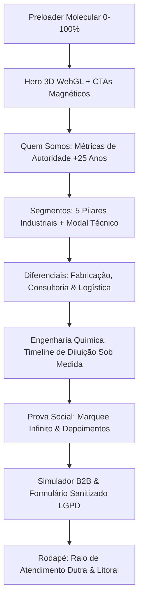

<div align="center">

# 🧪 DIPROL QUÍMICA INDUSTRIAL
### *Tradição & Confiança em Higiene Profissional e Química Especializada*

[](https://react.dev/)
[](https://www.typescriptlang.org/)
[](https://vitejs.dev/)
[](https://threejs.org/)
[](https://greensock.com/gsap/)
[](https://tailwindcss.com/)

<br />

> **Landing Page Institucional & Comercial B2B de Alto Impacto** desenvolvida para a **Diprol Química**, referência em fabricação e distribuição de saneantes especiais e produtos químicos para a indústria no **Vale do Paraíba, Litoral Norte e Região**.

[Visão Geral](#-visão-geral) • [Recursos & Destaques](#-recursos--destaques) • [Arquitetura](#-arquitetura-do-projeto) • [Stack Tecnológica](#-stack-tecnológica) • [Instalação](#-como-executar) • [Deploy & Segurança](#-segurança--deploy)

</div>

---

## 🌟 Visão Geral

A plataforma foi concebida sob o conceito de **Creative Technology**, aliando rigor técnico da engenharia química com estética moderna e translúcida (*Glassmorphism*). O projeto conta com:
- **Cena 3D interativa em WebGL (Three.js)** simulando clusters moleculares, refração óptica e partículas em suspensão que reagem ao mouse e scroll.
- **Smooth Scroll (Lenis)** perfeitamente acoplado ao ciclo de animações do **GSAP + ScrollTrigger** a estáveis 60 FPS.
- **Micro-interações físicas:** Botões com atração magnética (`gsap.quickTo`) e cards com efeito 3D Tilt por coordenadas de cursor.
- **Simulador de Economia B2B:** Cálculo de redução de custos operacionais com dosadores eletrônicos em comodato e ponte direta com WhatsApp corporativo.

---

## 🚀 Recursos & Destaques das Dobras



### 🔬 Dobras Implementadas:
1. **0. Preloader Molecular:** Animação de síntese química com contador percentual progressivo (0 → 100%) e transição fluida de abertura.
2. **1. Hero Interativa (Tradição & Confiança):** Canvas WebGL 3D em tempo real, tipografia *Outfit/Plus Jakarta Sans*, badges notificados ANVISA e CTAs magnéticos.
3. **2. Quem Somos / Autoridade:** Roll-up numérico animado (+25 anos de mercado, 12.000 ton/ano, +650 clientes corporativos e responsabilidade técnica CRQ-IV).
4. **3. Segmentos de Atuação:** 
   - 🍏 **Alimentícia & Frigoríficos:** Sanitizantes CIP e detergentes com laudos bactericidas.
   - 👔 **Lavanderia Industrial & Hospitalar:** Branqueamento termoquímico e conservação de enxoval.
   - 🚗 **Automotiva & Frotas:** Desengraxantes biodegradáveis e shampoos técnicos.
   - ⚙️ **Metalúrgica & Usinagem:** Desengraxe pós-usinagem, fosfatização e proteção anticorrosiva.
   - 🏢 **Institucional & Clínicas:** Desinfetantes hospitalares de 5ª geração e ceras de alto tráfego.
5. **4. Diferenciais Competitivos:** Cards em sequência (*stagger*) destacando fabricação própria, consultoria presencial in-loco em até 24h e frota dedicada.
6. **5. Engenharia de Soluções:** Timeline interativa das 4 etapas de implementação (Diagnóstico, Formulação Customizada, Comodato de Dosadores e Economia de até 40%).
7. **6. Prova Social & Marquee:** Faixa contínua infinita de clientes e parceiros industriais + depoimentos de gerentes de compras e planta industrial.
8. **7. Formulário de Cotação B2B:** Formulário com validação em tempo real, sanitização de inputs contra ataques XSS, consentimento LGPD e disparo de confetes com link direto para WhatsApp.
9. **8. Rodapé & Cobertura Regional:** Mapa com raio de atendimento no Vale do Paraíba (SJC, Taubaté, Jacareí, Pinda, Guaratinguetá, Litoral) e canal WhatsApp flutuante.

---

## 🛠️ Stack Tecnológica

| Camada | Tecnologia | Função no Projeto |
| :--- | :--- | :--- |
| **Frontend UI** | `React 19` + `TypeScript 6` | Componentes declarativos e arquitetura modular tipada |
| **Estilização** | `Tailwind CSS v4` | Tokens visuais, filtros de backdrop e utilitários modernos |
| **Renderização 3D** | `Three.js` + `WebGL` | Cluster molecular 3D, materiais físicos e dispersão reativa |
| **Animações** | `GSAP 3` + `ScrollTrigger` | Timelines, reveals, contadores e física magnética nos botões |
| **Smooth Scroll** | `Lenis` | Rolagem inercial suave sincronizada ao ticker do GSAP |
| **Ícones** | `Lucide React` | Ícones vetoriais de precisão técnica |
| **Micro-efeitos** | `Canvas-Confetti` | Celebração visual no envio do simulador de orçamento |
| **Bundle & Build** | `Vite 8` | Compilação ultrarrápida com divisão estratégica de chunks |

---

## 📐 Arquitetura do Projeto

```
diprol-quimica/
├── public/
│   └── favicon.svg                     # Identidade visual com hexágono molecular e gota
├── src/
│   ├── components/
│   │   ├── 3d/
│   │   │   ├── ChemicalHeroScene.tsx   # Cena WebGL 3D Three.js com cleanup e dispose()
│   │   │   └── LiquidBackgroundMesh.tsx # Malha de ondulação líquida sutil
│   │   ├── common/
│   │   │   ├── Counter.tsx             # Contador numérico GSAP ScrollTrigger
│   │   │   ├── GlassCard.tsx           # Card translúcido com inclinação 3D ao passar mouse
│   │   │   ├── MagneticButton.tsx      # Botão com atração magnética via GSAP quickTo
│   │   │   ├── Navbar.tsx              # Header responsivo com navegação fluida
│   │   │   └── SectionHeading.tsx      # Título padronizado com gradiente ciano e badge
│   │   └── sections/
│   │       ├── Preloader.tsx           # Dobra 0: Preloader molecular com contador 0-100%
│   │       ├── HeroSection.tsx         # Dobra 1: Hero com split-text e badges ANVISA
│   │       ├── AboutAuthoritySection.tsx # Dobra 2: Autoridade com contadores
│   │       ├── SegmentsSection.tsx     # Dobra 3: 5 Segmentos industriais e modal técnico
│   │       ├── DiferenciaisSection.tsx # Dobra 4: 4 Pilares competitivos em stagger
│   │       ├── CustomEngineeringSection.tsx # Dobra 5: Timeline de redução de custos
│   │       ├── SocialProofSection.tsx  # Dobra 6: Marquee contínuo e depoimentos
│   │       ├── QuoteCalculatorSection.tsx # Dobra 7: Simulador B2B e form sanitizado
│   │       ├── FooterSection.tsx       # Dobra 8: Logística no Vale do Paraíba
│   │       └── FloatingWhatsApp.tsx    # Botão flutuante inteligente de WhatsApp
│   ├── data/                           # Datasets tipados de produtos, métricas e clientes
│   ├── hooks/                          # Hooks para Lenis, Reduced Motion e Mouse Position
│   ├── types/                          # Interfaces TypeScript estritas
│   ├── utils/                          # Sanitização contra XSS, máscaras e validação
│   ├── App.tsx                         # Orquestrador da aplicação
│   ├── index.css                       # Design tokens, glassmorphism e animações
│   └── main.tsx                        # Entry point React
├── index.html                          # SEO, metadados OpenGraph e fontes Google
├── package.json                        # Dependências e scripts
└── vite.config.ts                      # Configuração com chunk splitting otimizado
```

---

## 💻 Como Executar Localmente

### 1. Clonar o Repositório
```bash
git clone git@github.com:luscanascimento/diprol-quimica.git
cd diprol-quimica
```

### 2. Instalar Dependências
```bash
npm install
```

### 3. Rodar em Ambiente de Desenvolvimento
```bash
npm run dev
```
Abra [http://localhost:5173](http://localhost:5173) no seu navegador.

### 4. Build de Produção
```bash
npm run build
```
Os arquivos otimizados serão gerados na pasta `dist/`.

### 5. Checagem de Lint
```bash
npm run lint
```

---

## 🛡️ Segurança & Boas Práticas

- **Sanitização de Inputs:** Proteção ativa contra injeção de HTML e ataques XSS em todos os campos de formulário.
- **Links Externos Seguros:** Aplicação obrigatória de `rel="noopener noreferrer"`.
- **Conformidade LGPD:** Caixa de seleção de consentimento transparente para uso de dados em propostas comerciais.
- **Acessibilidade (a11y):** Detecção automática de `prefers-reduced-motion` no sistema operacional do usuário, desativando rotações 3D contínuas e suavizando transições para evitar fadiga visual.
- **Performance 60 FPS:** Descarte rigoroso de texturas e geometrias (`dispose()`) no ciclo de vida do React para prevenir *memory leaks*.

---

## 👤 Autor

Desenvolvido com excelência técnica por **Lucas Nascimento** ([@luscanascimento](https://github.com/luscanascimento)).

---

<div align="center">
  <sub>Diprol Química Industrial Ltda • Todos os direitos reservados.</sub>
</div>
